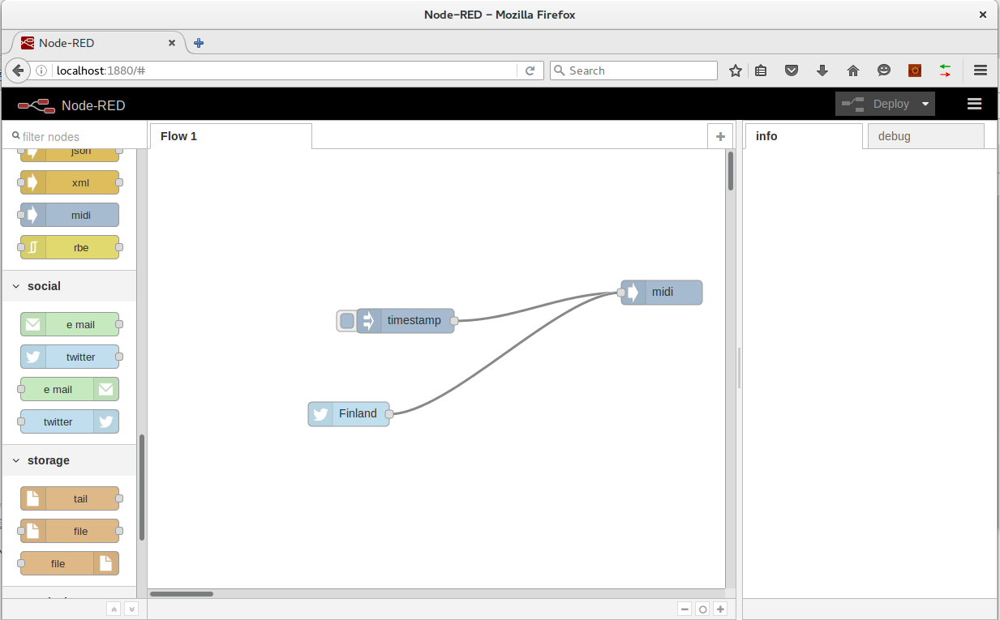

Summary
=======

This is a simple Node-RED module playing MIDI sounds when it receives a Node-RED message.

Currently it plays a sequence of three grand piano notes. Of course it is easy to customize this to
play what ever based on the message content.

This could be useful in making silent (pun intended) information happening on the network observable, or
for making sound effects for specific events. Beeps are so 1990s anyhow.

Usage
=====

This is designed to work on Ubuntu, but with small changes you can make it work on any Linux.

First run: `./install_prerequisites.sh`

The start the Fluidsynth daemon: `./start_fs.sh`

Then: `npm start`

Then point your browser to: http://localhost:1880

Then connect for example an inject input module to midi output module, deploy, and then click the button on the inject module.
Sounds should ensue.

Potential problems: Currently this is hard coded to use the first MIDI device after the midi-through port, that is the Fluidsynth port. After all, all my computers and my Raspberry Pi have this arrangement. Your mileage might vary. See the code.

Screenshot
==========

License: ISC
